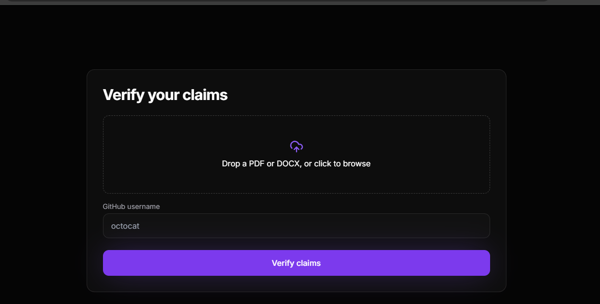
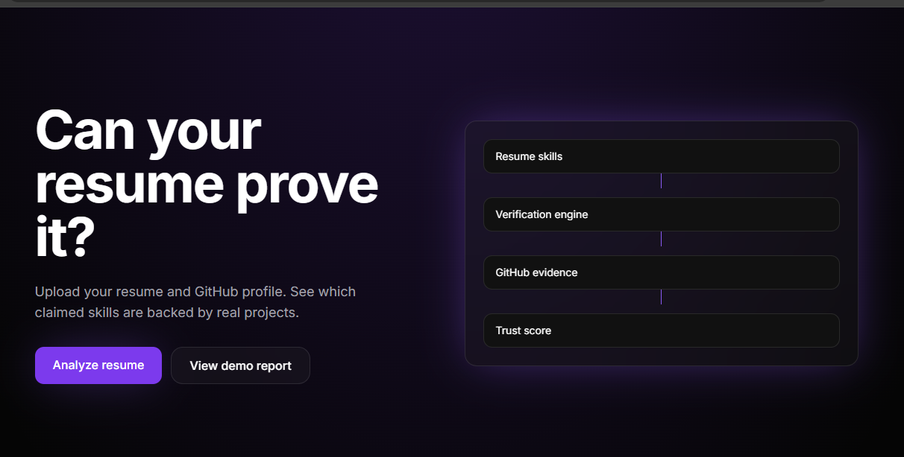
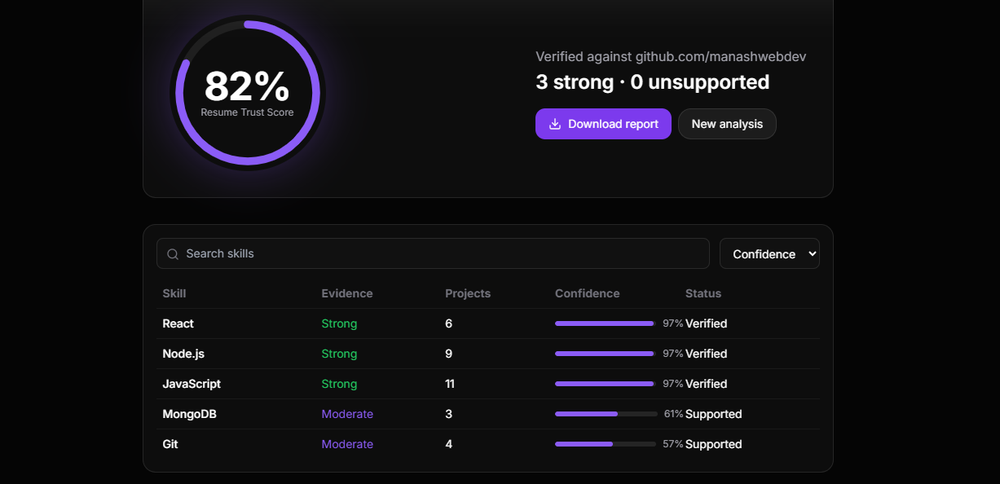

# Resume Claim Verifier

> Don't just claim skills. Prove them.

Resume Claim Verifier is a full-stack hiring-tech application that validates resume skills using real GitHub evidence.

Instead of relying solely on self-reported skills, the platform analyzes a candidate's GitHub repositories, project descriptions, topics, languages, and README files to determine whether resume claims are supported by actual work.

---

## Problem

Many developers list technologies on their resumes:

* React
* Node.js
* MongoDB
* Docker
* AWS
* TypeScript

Recruiters and hiring managers often spend significant time manually checking GitHub profiles to verify whether those skills are genuinely demonstrated through projects.

This process is slow, inconsistent, and difficult to scale.

---

## Solution

Resume Claim Verifier automatically compares resume claims against GitHub evidence.

The system:

1. Extracts skills from a resume
2. Fetches GitHub repositories
3. Analyzes project metadata
4. Matches claimed skills with repository evidence
5. Generates a recruiter-friendly verification report

---

## Features

### Resume Parsing

Upload PDF resumes and automatically extract technical skills.

### GitHub Repository Analysis

Analyze:

* Repositories
* Languages
* Topics
* Project descriptions
* README files

### Skill Verification

Determine whether each claimed skill is backed by real project evidence.

### Resume Trust Score

Generate an overall trust score based on supporting evidence.

### Evidence-Based Reporting

Classify skills as:

* Strong Evidence
* Moderate Evidence
* Weak Evidence
* No Evidence

### Search & Filtering

Quickly inspect verification results.

### PDF Report Export

Download verification reports for sharing and review.

---

## How It Works

### Step 1

Upload:

* Resume PDF
* GitHub Username

### Step 2

Extract skills from the resume.

Example:

```txt
React
Node.js
MongoDB
Docker
AWS
```

### Step 3

Analyze GitHub repositories.

The system inspects:

* Repository names
* Languages
* Topics
* Descriptions
* README content

### Step 4

Match resume claims against project evidence.

Example:

```txt
React   → Found in 6 repositories
Node.js → Found in 9 repositories
MongoDB → Found in 3 repositories
Docker  → No evidence found
AWS     → No evidence found
```

### Step 5

Generate a verification report.

```txt
React      Strong Evidence
Node.js    Strong Evidence
MongoDB    Moderate Evidence
Docker     Weak Evidence
AWS        No Evidence
```

---

## Screenshots

### Upload Resume



### Dashboard Overview



### Verification Report



---

## Tech Stack

### Frontend

* Next.js
* TypeScript
* Tailwind CSS
* Framer Motion
* Lucide Icons

### Backend

* Node.js
* Express.js

### APIs & Services

* GitHub REST API
* PDF Parsing
* Resume Skill Extraction

### Deployment

* Vercel
* Render

---

## Project Structure

```bash
Resume-Claim-Verifier
│
├── frontend
│   ├── app
│   ├── components
│   ├── lib
│   └── public
│
├── backend
│   ├── src
│   ├── routes
│   ├── services
│   └── utils
│
├── README.md
└── .gitignore
```

---

## Local Setup

### Backend

```bash
cd backend
npm install
npm start
```

Runs on:

```txt
http://localhost:4000
```

Optional:

```bash
GITHUB_TOKEN=your_token npm start
```

---

### Frontend

```bash
cd frontend
npm install
npm run dev
```

Runs on:

```txt
http://localhost:3000
```

---

## Deployment

### Backend

Deploy to Render.

Environment Variables:

```env
GITHUB_TOKEN=your_token
```

---

### Frontend

Deploy to Vercel.

Environment Variables:

```env
NEXT_PUBLIC_API_URL=your_backend_url
```

---

## Future Improvements

* Evidence Timeline View
* Gemini AI Skill Reasoning
* Repository Quality Analysis
* Recruiter Dashboard
* Team Hiring Mode
* Skill Confidence Explanations
* Advanced Verification Engine

---

## Why This Project Stands Out

Most resume tools focus on formatting and optimization.

Resume Claim Verifier focuses on trust and evidence.

It answers a more important question:

> Can a candidate actually prove the skills listed on their resume?

This makes the platform valuable for developers, students, recruiters, and hiring teams.

---

## Author

Manash Khati

GitHub: https://github.com/manashwebdev
